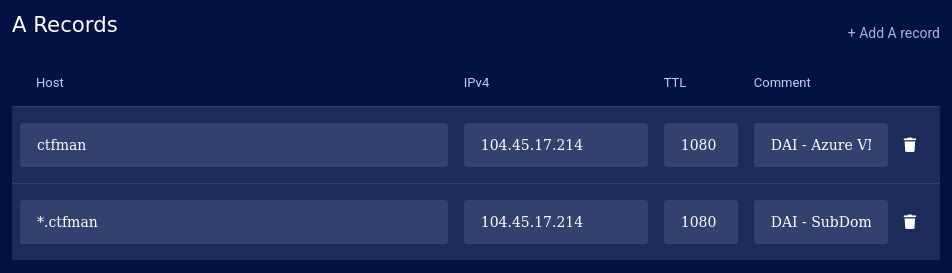
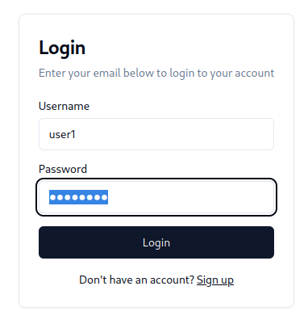
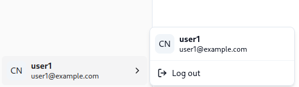
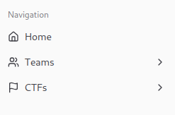
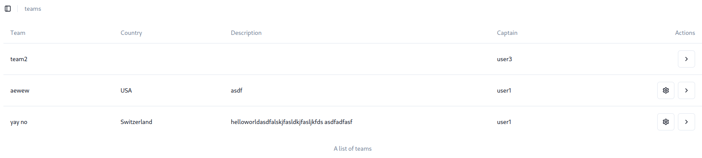
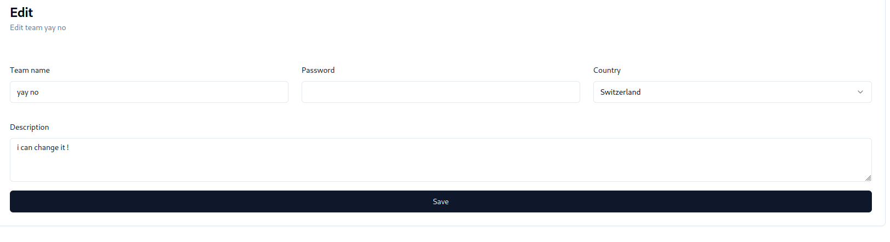
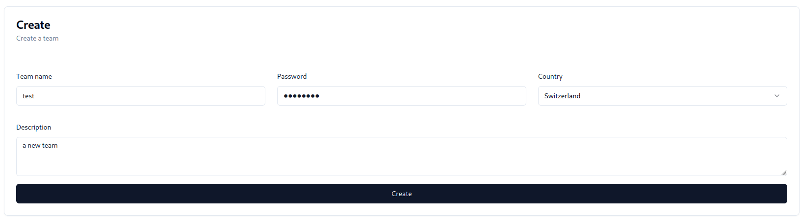
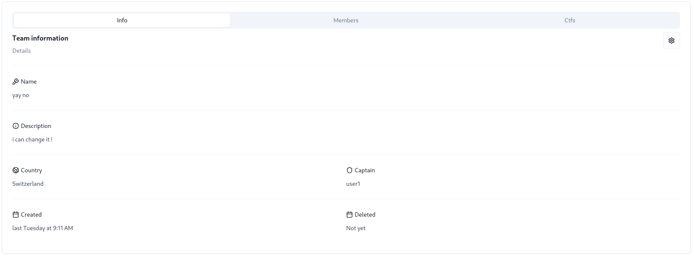

# CTFman

<a name="readme-top"></a>

<details>
  <summary>Table of Contents</summary>
  <ol>
    <li>
        <a href="#built-with">Built With</a>
    </li>
    <li><a href="#introduction">Introduction</a></li>
    <li>
        <a href="#getting-started">Getting Started</a>
      <ul>
        <li><a href="#prerequisites">Prerequisites</a></li>
        <li><a href="#running-in-local">Local</a></li>
        <li><a href="#running-with-docker">Docker</a></li>
        <li><a href="#running-with-docker-compose">Docker Compose</a></li>
      </ul>
    </li>
    <li>
        <a href="#documentation">Documentation</a>
      <ul>
        <li>
            <a href="#vm---azure">VM with Azure</a>
          <ul>
            <li><a href="#installation">Installation</a></li>
            <li><a href="#configuration">Configuration</a></li>
          </ul>
        </li>
        <li><a href="#zone-dns">Zone DNS</a></li>
        <li><a href="#api">API</a></li>
      </ul>
    </li>
    <li>
        <a href="#usage">Usage</a>
      <ul>
        <li><a href="#examples-using-curl">Curl</a></li>
        <li><a href="#examples-using-the-ui-on-a-web-browser">UI on web browser</a></li>
      </ul>
    </li>
    <li><a href="#license">License</a></li>
    <li><a href="#contacts">Contacts</a></li>
  </ol>
</details>

### Built With

- [Java 21 temurin][java]
- [Maven][maven]
- [Docker][docker]
- [Picocli][picocli]
- [PostgreSQL][postgresql]
- [Swagger][swagger]
- [Javalin][javalin]
- [Microsoft Azure][azure]
- [SvelteKit][sveltekit]

<p align="right">(<a href="#readme-top">back to top</a>)</p>

<!-- INTRODUCTION -->

## Introduction

The goal of `CTFman` - a web application using a database - is to efficiently manage Capture The Flag (CTF) competitions. The database will store and organize information about CTFs, participants, teams, tools, and performance metrics. This will allow for:

- Historical Tracking: Preserving records of competitions, which is essential since CTFs are only accessible for a limited time during the event duration.
- Data Interaction: Providing a seamless interface to visualize, modify, and manage the stored data.
- Comprehensive Functionality: Enabling functionalities like managing team registrations, tracking user activities, organizing challenges, managing tools and resources, and moderating comments.

> [!NOTE]
> CTF - Capture The Flag - is a competition where participants solve cybersecurity challenges to gain points and compete against others.

> [!CAUTION]
> Hacking is not necessarily a negative practice. In fact, it plays an essential role in learning and discovering existing vulnerabilities in computer systems. Through disciplines like CTF (Capture the Flag), cybersecurity enthusiasts can develop skills by identifying potential flaws and understanding how they could be exploited. This knowledge is then used to strengthen system security and prevent future attacks. Thus, ethical hacking or "white hat" hacking actively contributes to the protection of digital infrastructures by anticipating risks and proposing solutions.

<p align="right">(<a href="#readme-top">back to top</a>)</p>

<!-- GETTING STARTED -->

## Getting Started

### Prerequisites

#### Java 21

- [asdf][asdf]

  ```sh
  # Install the plugin if needed
  asdf plugin add java
  # Install
  asdf install java latest:temurin-21
  ```

- Mac (homebrew)

  ```zsh
  brew tap homebrew/cask-versions
  brew install --cask temurin@21
  ```

- Windows (winget)

  ```ps
  winget install EclipseAdoptium.Temurin.21.JDK
  ```

### For Developer

If are a standard user go [here](https://github.com/shadowkudo/ctfman/edit/main/README.md#usage).

#### Running in local

Clone this repository with either `ssh` or `http`, but we recommend using `ssh` as it is more secure.

```sh
git clone git@github.com:shadowkudo/ctfman.git
```
Use the maven wrapper to install dependencies, build and package the project.

```sh
# install the dependencies
./mvnw clean install
# build
./mvnw package
# run
java -jar target/<filename>.jar --help
```

#### Running with Docker

Build the Docker image and publish it to GitHub Container Registry:

```sh
docker build -t ghcr.io/<username>/ctfman:latest
docker push ghcr.io/<username>/ctfman:latest
```

> [!NOTE]
> We used GitHub Actions so that it publishes automaticaly when new commit is done in main branch.

#### Running with Docker Compose

Run the application using Docker Compose:

```sh
docker compose --profile dev up -d
```

<p align="right">(<a href="#readme-top">back to top</a>)</p>

<!-- DOCUMENTATION -->

## Documentation

### VM - Azure

In our project, we choose to use Microsoft Azure as the provider for the virtual machine for our web server. See below for the installation and configuration process for a student account. 

#### Installation

Access the Azure portal with the following link: <https://portal.azure.com> and log in.

Create a new virtual machine from the dashboard in section `Create a resource`.

Select a virtual machine with the following characteristics:

- **Project details**
  - **Subscription**: Azure for Students
  - **Resource group**: Create new with the name `heig-vd-dai-course`
- **Instance details**
  - **Virtual machine name**: `heig-vd-dai-course-vm`
  - **Region**: (Europe) West Europe
  - **Availability options**: No infrastructure redundancy required
  - **Security type**: Trusted launch virtual machines (the default)
  - **Image**: Ubuntu Server 24.04 LTS - x64 Gen2 (the default)
  - **VM architecture**: x64
  - **Size**: `Standard_B1ms` - you might need to click _"See all sizes"_ to see
    this option
- **Administrator account**
  - **Authentication type**: SSH public key
  - **Username**: `ubuntu` - please use this username so the teaching staff can
    help you if needed
  - **SSH public key source**: Use existing public key
  - **SSH public key**: Paste your public key here - see the note below for more
    information
- **Inbound port rules**
  - **Public inbound ports**: Allow selected ports
  - **Select inbound ports**: HTTP (80), HTTPS (443), SSH (22)

> [!CAUTION]
> The server needs to have at least 2 GiB RAM so that it will not freeze ! You may also add a swap file of 1 GiB to be more secure on memory usage.

Click on the `Review + create` button.

Validate the configuration and click on the `Create` button.

It might take a few minutes to create the virtual machine. Once the virtual
machine is created, you can access it with the `Go to resource` button.

Note the public IP address of the virtual machine. You will need it to connect
to the virtual machine with SSH later.

#### Configuration

In this section, you will access the virtual machine with SSH and configure it.

Using the public IP address of the virtual machine, you can connect to the
virtual machine with SSH with the following command:

```sh
# Connect to the virtual machine with SSH
ssh ubuntu@<vm public ip>
```

The first time you connect to the virtual machine, you will be asked to confirm
the fingerprint of the public key of the virtual machine.

The output should be similar to the following:

```text
The authenticity of host '104.45.17.214 (104.45.17.214)' can't be established.
ED25519 key fingerprint is SHA256:Xl0X5kv+aeZV28XA9iJ/L+geFVVvOvG4foRixbGRYnY.
This key is not known by any other names.
Are you sure you want to continue connecting (yes/no/[fingerprint])?
```

You can type `yes` and press the `Enter` key.

Once connected to the virtual machine, you can update the packages with the
following command:

```sh
# Update the available packages
sudo apt update

# Upgrade the packages
sudo apt upgrade
```

You can then reboot the virtual machine with the following command to apply all
the updates:

```sh
# Reboot the virtual machine
sudo reboot
```

Install and configure Docker and Docker Compose on the virtual machine. You will need them to run our web application.

Congratulations! You have now an up-to-date and configured virtual machine to use.

<p align="right">(<a href="#readme-top">back to top</a>)</p>

### Zone DNS

For the server to be accessible easily on the Internet, you need to set up a DNS - Domain Name Server - so that you will use a name instead of a ip address to access the server remotely.

You need to either buy a domain name (like we did using [Polisystems][polisystems]) or use a free domain name (see [Duckdns][duckdns]).

Add an A record to the DNS zone of your domain name provider to point to the IP address of the virtual machine.

Add a second wildcard A record to the DNS zone of your domain name provider to point to the IP address of the virtual machine. This will allow access to all your services hosted under a subdomain of your domain name.



#### Validation

Test the DNS resolution of the DNS records you added from the virtual machine and from your local machine.

```sh
# Test the DNS resolution
nslookup ctfman.cybernest.ch
```

On success, the output should be similar to the following:

```sh
Server:		192.168.247.244
Address:	192.168.247.244#53

Non-authoritative answer:
Name:	ctfman.cybernest.ch
Address: 104.45.17.214
```

On failure, the output should be similar to the following:

```sh
Server:		192.168.247.244
Address:	192.168.247.244#53

** server can't find heig-vd-dai-course.duckdns.org: NXDOMAIN
```

> [!NOTE]
> You might have to wait a few minutes (max 15 minutes in our experience) for the DNS record to be propagated and get a successful response. In case you use a WIFI to connect to the Internet, it may take longer if their cache take more time to reset (if during your configuration you made an error and had to update it)!

### API

With `Swagger`, documentation is created during coding; see the endpoint `https://api.ctfman.cybernest.ch/swagger` or `https://api.ctfman.cybernest.ch/redoc` to look at the API documentation.

> [!NOTE]
> It is recommended to use `swagger` as you can try the API easily.

<p align="right">(<a href="#readme-top">back to top</a>)</p>

<!-- USAGE -->
#### Usage

1. Starting the database
```sh
docker compose up db -d
```
2. Setting up the database and populate it with data
```sh
docker compose run --rm prod setup --seed
```
3. Starting the web application
```sh
docker compose up prod -d
```
4. Accessing the application in a browser (tested with `Firefox`)
```sh
firefox https://ctfman.cybernest.ch
```

> [!IMPORTANT]
> You can go directly to step 4, as you do not have access to the server. In case a problem occur, create an issue here with the tag `bug` and we will try our best to support you!

<p align="right">(<a href="#readme-top">back to top</a>)</p>

#### Examples using Curl

If not yet installed, do (for Ubuntu systems):

```sh
# Install curl
sudo apt install curl
```

##### Login as an user

```sh
curl -i -X 'POST' \
  'https://api.ctfman.cybernest.ch/login' \
  -H 'accept: */*' \
  -H 'Content-Type: application/json' \
  -d '{
  "username": "user1",
  "password": "password"
}'
```

Will get:

```sh
HTTP/2 204
content-type: text/plain
date: Fri, 17 Jan 2025 16:57:54 GMT
expires: Thu, 01 Jan 1970 00:00:00 GMT
set-cookie: session=HTOsOvSX0eEPXaAwy76Zjwjaadim9bWeD4-DkOMVjqg; Path=/; Secure; SameSite=None
```

##### Get profile

```sh
curl -X 'GET' \
  'https://api.ctfman.cybernest.ch/profile' \
  -H 'accept: application/json' \
  -H 'Cookie: HTOsOvSX0eEPXaAwy76Zjwjaadim9bWeD4-DkOMVjqg'
```

> [!IMPORTANT]
> As seen here, you need to add the cookie from the login response to all the future request as you need to be logged in to access other information. The only exception would be to logout as it will not give confidential information.

Will get:

```sh
HTTP/2 200
content-type: application/json
date: Fri, 17 Jan 2025 17:09:47 GMT
content-length: 188

{"createdAt":"2025-01-13T12:49:41Z","deletedAt":null,"authentication":"user1","primaryContact":"user1@example.com","isChallenger":true,"isAdmin":false,"isModerator":false,"isAuthor":false}
```

##### Logout

```sh
curl -i -X 'POST' \
  'https://api.ctfman.cybernest.ch/logout' \
  -H 'accept: */*' \
  -d ''
```

Will get:

```sh
HTTP/2 204
content-type: text/plain
date: Fri, 17 Jan 2025 16:58:16 GMT
expires: Thu, 01 Jan 1970 00:00:00 GMT
set-cookie: session=; Path=/; Expires=Thu, 01-Jan-1970 00:00:00 GMT; Max-Age=0
```

> [!NOTE]
> I think with those examples, you understood how it works. For others endpoints it will work the same way; be careful to never forget the cookie in the request !

<p align="right">(<a href="#readme-top">back to top</a>)</p>

#### Examples using the UI on a web browser

The following examples have been made with [Firefox][firefox].

Login:



Logout:



Navigation:



List teams:



Edit team:



Create team:



Team details:



> [!NOTE]
> It will work the same way for other field like CTF.

<p align="right">(<a href="#readme-top">back to top</a>)</p>

<!-- CONTRIBUTING -->

## Contributing

Contributions are what make the open source community such an amazing place to learn, inspire, and create. Any contributions you make are **greatly appreciated**.

1. Fork the Project
2. Create your Feature Branch (`git checkout -b feature/AmazingFeature`)
3. Commit your Changes (`git commit -m 'Add some AmazingFeature'`)
4. Push to the Branch (`git push origin feature/AmazingFeature`)
5. Open a Pull Request

<p align="right">(<a href="#readme-top">back to top</a>)</p>

<!-- LICENSE -->

## License

Distributed under the MIT License. See `LICENSE` for more information.

<p align="right">(<a href="#readme-top">back to top</a>)</p>

<!-- CONTACTS -->

## Contacts

- [Kénan Augsburger](https://github.com/Mondotosz)
- [David Schildböck](https://github.com/shadowkudo)
- [Arno Tribolet](https://github.com/arnoheigvd)

> [!IMPORTANT]
> Have fun !

<p align="right">(<a href="#readme-top">back to top</a>)</p>

<!-- MARKDOWN LINKS & IMAGES -->
<!-- https://www.markdownguide.org/basic-syntax/#reference-style-links -->

[java]: https://adoptium.net/temurin/releases/
[maven]: https://maven.apache.org/
[docker]: https://www.docker.com/
[picocli]: https://picocli.info/
[asdf]: https://asdf-vm.com/
[postgresql]: https://www.postgresql.org/ 
[swagger]: https://swagger.io/
[javalin]: https://javalin.io/
[azure]: https://azure.microsoft.com/en-us/explore
[duckdns]: http://www.duckdns.org/
[polisystems]: https://polisystems.ch/en/index
[firefox]: https://www.mozilla.org/en-US/firefox/new/
[sveltekit]: https://svelte.dev/tutorial/kit/introducing-sveltekit
